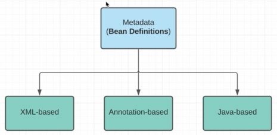
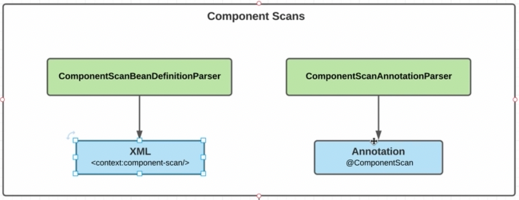
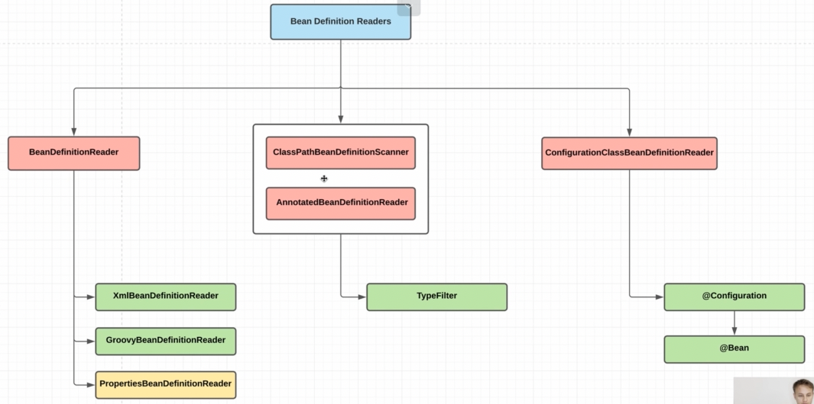

    Для того, чтобы доставлять метаинфу (БинДефинишн) для наших бинов, служат БинДефинишнРидеры. МетаИнфа может 
    предотсавляться при помощи:

    Для сканирования метаинфы для бинов применяются два класса:

### BeanDefinitionReaders

