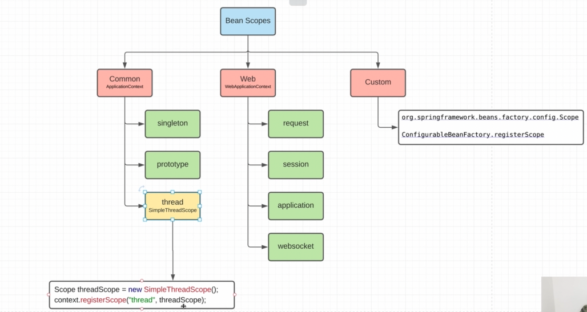

По-умолчанию все бины singleton. 
    
    prototype - сколько мы у одного контекста будем просить бин, он всегда будет возвращать новый. Спринг не хранит
        prototype - бины в контексте, т.к. бины лежат в мапе и имеют уникальный ключ. Прототайп мы неможем так хранить. 
        Поэтому, когда мы у IoC - контейнера просим бин-прототип, берется бинДефинишн прогоняется через контейнер и 
        возвращается бин - но этот бин в контейнере не хранится.