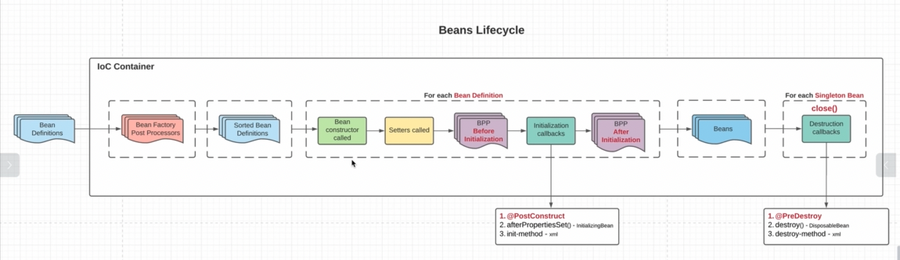

    1. в IoC на вход приходит BeanSefinitions(наша метаИнформация);
    2. Теперь нам нужно их как-то отсортировать. Т.к. мы понимаем, что какие-то бины зависят от других, значит создавать 
        их нужно в каком-то порядке; Бины, которые не зависят ни от чего создаются в первую очередь;
    3. Отсортировав бины инициализируются. Создаем объект через конструктор и далее вызываются соответствующие сеттеры;
    4. На ваыходе мы получаем готовые бины;

## Lifecycle Callbacks

    Initiafization callbacks - после коструктора и сеттеров, мы можем дополнительно подкрутить наш бин. Три способа:
    1. @PostConstruct - предпочтительный варик
    2. afterPropertiesSet() - initializingBean
    3. init-method - xml
    Если мы заюзали все три способа, то и сработают все в порядке, как представлено

    Destruction callbacks - мы хотим очистить ресурсы, которые использует наш бин. Это совокупность методов, которые 
        будут вызываться, когда мы закрываем наш контекст. Три способа:
    1. @PreDestroy
    2. destroy() - DesposableBean
    3. destroy-method - xml

    
    BeanFactoryPostProcessor (BFPP) - тут мы читаем Expression Language и SpEL и пордкручиваем наши beanDefinitions. 
        Так же тут мы инициализируем бины, которые нужны для инициализации других бинов.
    
## Beans Post Processor (BPP)

    Отсюда, полный жизненный цикл состоит из:
    1. Предоставления наших BeanDefinitions (соответсвующие объекты, реалтзующие интерфейс BeanDefinitions) ->
        -> далее они попадают к нам IoC - контейнер.
    2. Контейнер сразу направляет BeanDefinitions в BeanFactoryPostProcessors, которые нужна чтобы подкрутить наши 
        БинДефинишены, например внедорить наши проперти (как бы это делали используя EL и SpEL) -> 
    3. Теперь нам нужно отсортировать бинДефинишены, т.к. мы не ножем проинициализировать одни бинДефинишены, раньше 
        других, т.к. одни завиясят от других -> 
    4. Далее, мы берем их ПО-ОДНОМУ (это важно, там обычный forEach) и вызываем конструктор у бинДефинишена -> 
    5. далее вызываем сеттеры ->
    6. тут вызывается BeforeInitialization-метод у наших BeanPostProcessor(BPP) и в этот метод попадает уже БИН, т.к. 
    мы заюзали уже и конструктор и сеттер, получив Бин и в нем уже проинжектаны все соответствующие зависимости -> 
    7. вызываем InitializationCallback(дополнительно подкрутить наш бин). Кста @PostConstruct - это тоже BPP и он просто 
        вызывается последним ->
    8. вызываем AfterInitialization-метод у наших (этих же) BeanPostProcessor(BPP) для тех же самых бинов с таким же 
        самым id (обычто тут создаются прокси; подмена одних бинов на другие и т.д.) ->
    9. Только после всего этого мы получаем все наши бины. И если этот бин-синглтон, то он остается в нашем 
        IoC-контейнере. Если это другой скоуп(не синглтон), мы сразу его возвращаем тому, кто его попросил и не держим 
        в нашей map;
    10. @PreDestroy
        