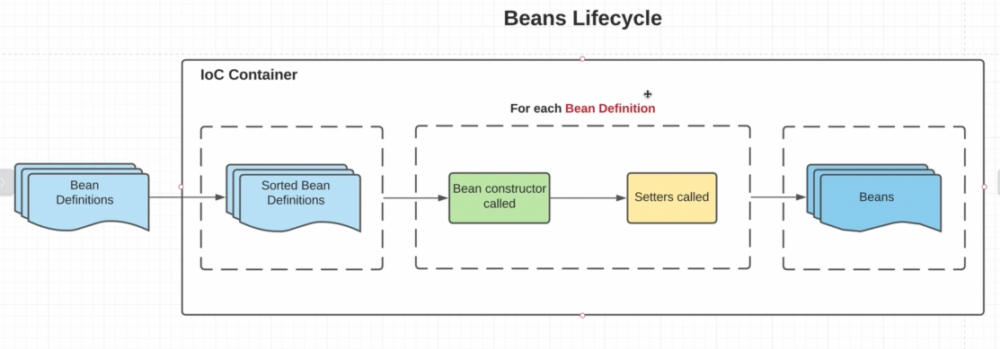
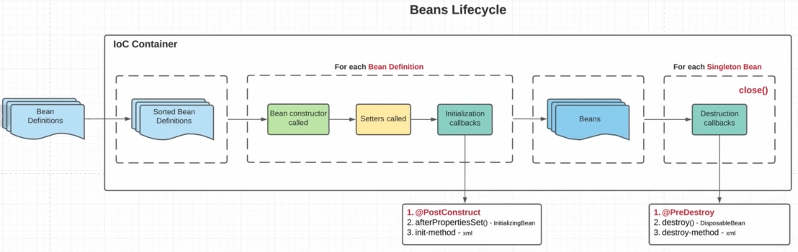
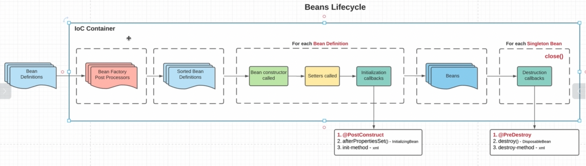

    1. в IoC на вход приходит BeanSefinitions(наша метаИнформация);
    2. Теперь нам нужно их как-то отсортировать. Т.к. мы понимаем, что какие-то бины зависят от других, значит создавать 
        их нужно в каком-то порядке; Бины, которые не зависят ни от чего создаются в первую очередь;
    3. Отсортировав бины инициализируются. Создаем объект через конструктор и далее вызываются соответствующие сеттеры;
    4. На ваыходе мы получаем готовые бины;

## Lifecycle Callbacks

    Initiafization callbacks - после коструктора и сеттеров, мы можем дополнительно подкрутить наш бин. Три способа:
    1. @PostConstruct - предпочтительный варик
    2. afterPropertiesSet() - initializingBean
    3. init-method - xml
    Если мы заюзали все три способа, то и сработают все в порядке, как представлено

    Destruction callbacks - мы хотим очистить ресурсы, которые использует наш бин. Это совокупность методов, которые 
        будут вызываться, когда мы закрываем наш контекст. Три способа:
    1. @PreDestroy
    2. destroy() - DesposableBean
    3. destroy-method - xml

    
    BeanFactoryPostProcessor (BFPP) - тут мы читаем Expression Language и SpEL и пордкручиваем наши бины. Так же тут мы 
        инициализируем бины, которые нужны для инициализации других бинов.
    