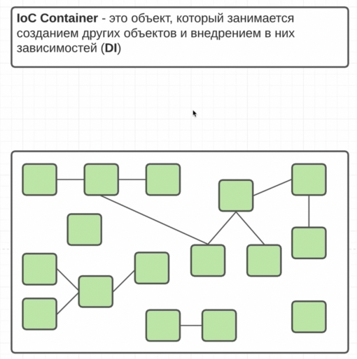
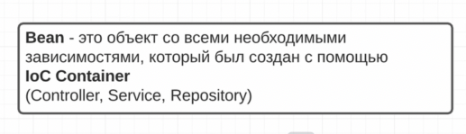
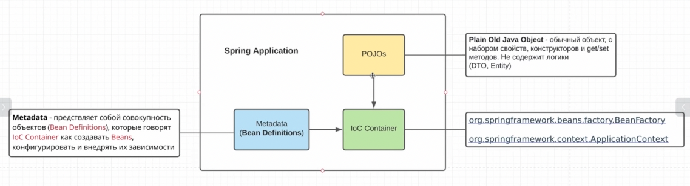
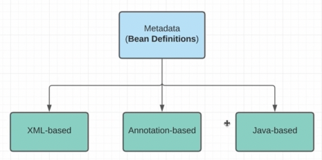

## IoC Container

## Bean

    Контейнер - это своего рода ассициативный массив, где лежит куча наших бинов. И если мне нужен какой-то бин, 
    то я просто его прошу у нашего IoC-конейнера. Ключ - какой-то уникалиный string, а значением запрашиваемый объект (бин)

## Spring Application

    Иными словами:
    Bean Definition - это чертеж
    Bean - это делать, созданная по чертежу
    Это все MetaData

## Как IoC-Контейнеру предоставить инфу о том, как создавать бины. 3 варианта:
