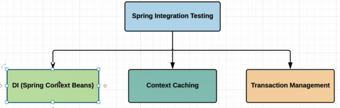
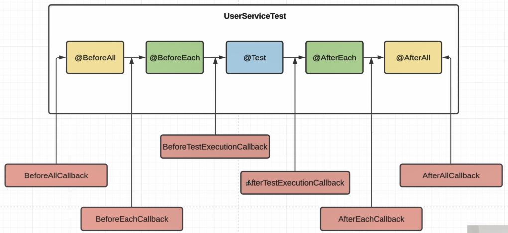
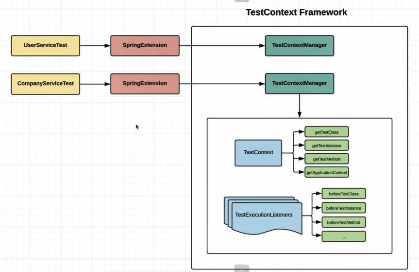

    DI - dependecy Injection (Spring Context Bean) - задача поднять спрингКонтекст и внедрять все бины в наши тестовые 
        классы;
    Context Caching - кэширование наших контекстов. Если мы будет запускать спринг контекст перед каждым тестом 
        то это будет слишком расточительно.
    Transaction Management - при работе с БД пушить что-то в БД, проверять и откатывать изменения.

    
    По умолчанию создается на КАЖДЫЙ тестовый метом новый инстанс.
    Мы можем внедриться в жихненный цикл теста и:
    - Exception handling - обработать исключения;
    - Test instance post-processing - подкрутить наш инстанс;
    - Conditional test execution - можем добавлять какие-то кондишены - стоит вызывать наш тест или нет; Скипнуть тест;
    - Parameter resolution - это DI-механизм, только от junit;
    - Test lifecycle callbacks 

    КоллБэки - это функциональные интерфейсы.
    Что-бы заюзать коллбэки, нужно реализовать соответствующий интерфейс и над классом подставить из использование через 
    @ExtendWith(*.class)

### В спринге реализован свой фрейм для интеграционных тестов
    