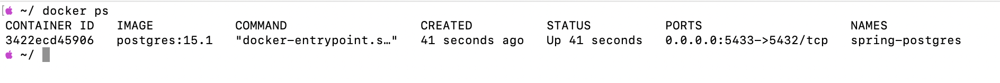
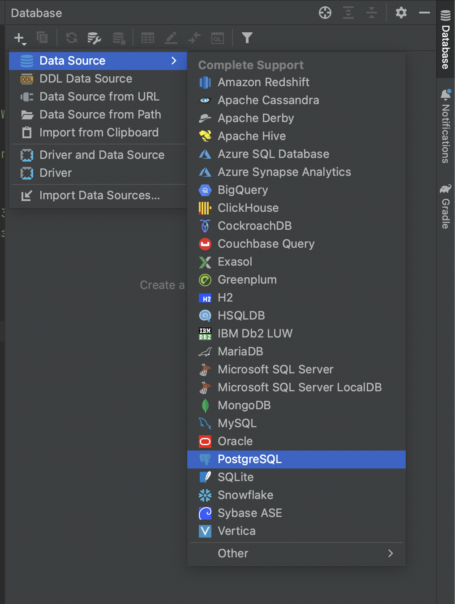
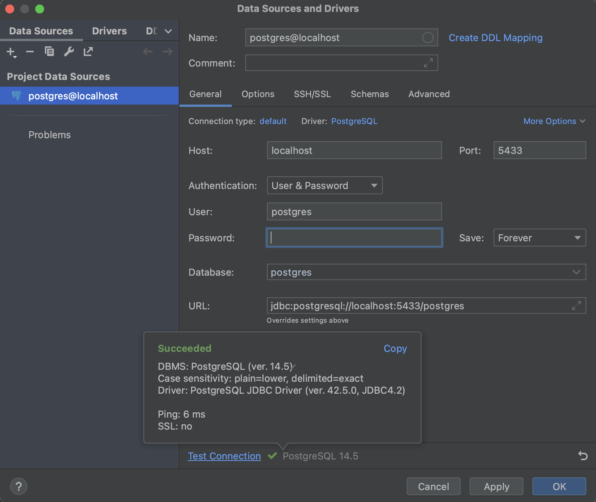
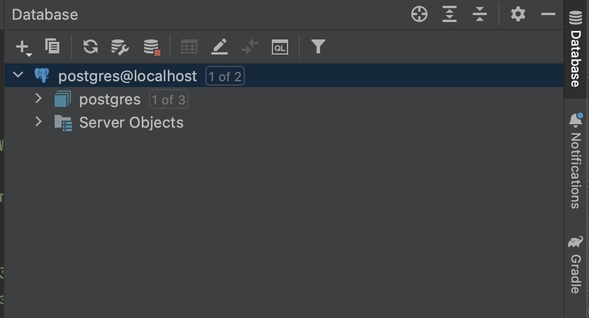

    1. Ставим Докер (docs.docker.com)
    2. В cmd пишем docker ps - проверяем работает ли
    3. Теперь нужно поднять нужный image. Гуглим: postgres image - переходим hub.docker.com Тут мы видим все доступные
    образы. Чуть ниже есть описание, как его запустить:
        docker run --name spring-postgres -e POSTGRES_PASSWORD=pass -p 5433:5432 -d postgres:15.1
            - some-postgres - имя контейнера
            - имя юзера не указано, значит заиспользовано по-умолчанию - postgres. Либо можно заиспользовать
                POSTGRES_USER
            - пароль поменяем
            - -p 5433:5432 - порты. 33 - это порт наружу, 32 - порт внутри контейнера
            - postgres:15.1 - если не указать будет использована latest. Мы указали версию явно.

### Подключимся из IDEA
    1. Database - "+" - Data Source - PostgresSQL

    
    2. вводим наши значения - test connection

    3. apply - ok
