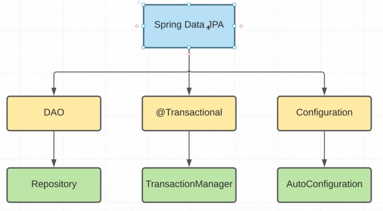

    Вспоминая Хибер, что нас не устраивало там:
        - DAO - repository слой нам нужно было писать руками;
        - @Transactional - есть только аннотация. Функционал нам нужно описывать самим;
        - Конфигурация хибера - xml эти все не оч удобно.
        
        все это решает Спринг
        

    