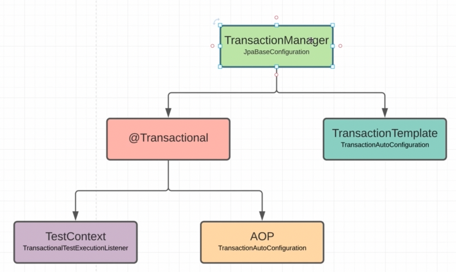
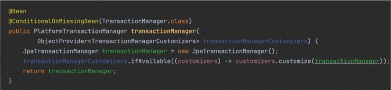

### Transactional manager

    config - нам даже не нужно создавать этот бин - все делает автоконфигурация.

    Transactional manager можно юзать двумя способами:
        - декларативный - @Transactional - чаще всего
        - вручную - TransactionalTemplate

### Тесты
    В тестах я могу юзать EntityManager.
    Так же можно использовать @PersistenceContext(EntityManagerFactory) и @PersistenceUnit(EntityManager). Но на 
    практике чаще используют привычную @Autowired (она идет по умолчанию и можно опустить)

    @Transactional - теперь я не управляю транзакциями. Это делает спринг.
    @Rollback - установлена по умолчанию. Если что-то пошло не так - откати. Да и вообще, тест прошел - откати то, что 
    накатили в тесте
    @Commit - противоположность rollback