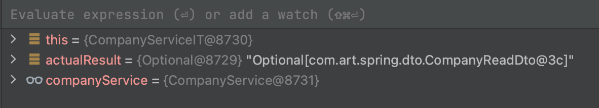
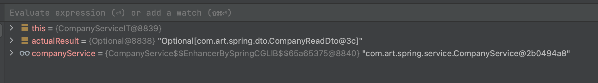
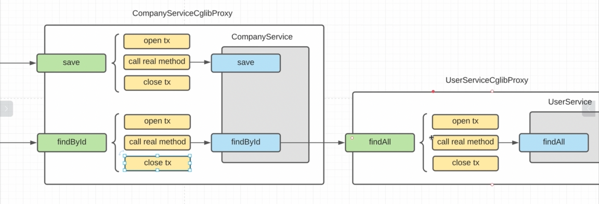

    В TransactionAutoConfiguration.class и здесь происходит создание нашего транзакшнМанагера как в мануальном, так и
    в декларативном виде. + У нас тут есть TransactionProperties.class, который настраивается через
        prefix = "spring.transaction"
    и тут мы можеи настраивать таймауты, rollBackOnCommitFailure и т.д. 
    Чуть ниже мы видим тут основные классы. Первым TransactionTemplate.class - это мы будем использовать для ручного 
    управления транзакциями. Он есть, но и как большинство бинов мы можем его заменить своим.

    EnableTrasactionaManagmentConfiguration.class - основной красс, который настраивает наше управление трензакцией через 
    @Transactional. (Без автоконфигурации-без springBoot нужно использовать @EnableTransactionManagement вручную, чтобы 
    включить механизм обработки @Transactional)
    И тут у нас 2 варианта, как будут создавать наши прокси:
        1. Через JdkDynamicAutoProxy - но он по умолсанию выключен (через prefix = "spring.aop" можем регулировать создание
            нашего прокси)

        2. CglibProxy - включен по умолчанию - и это прокси через наследование.

    Запустим тест и видим, что CompanyService - это реальный объект.

    
    А теперь поставим @Transactional над CompanyService.class (Если ставим над классом, значим для всех методов в классе 
    будут управляться транзакции. Если над конкретным методом - понятно. Если на классом и над методом стоит - то 
    приоритет у той, что над классом). Теперьт перезапустив тест, мы видим, что у нас уже прокси, при чем cglibProxy

### Как работает прокси

    У нас есть CompanyServiceCglibProxy, который extends реальный CompanyService, а значит у него есть все поля родителя,
    только они установлены в null и методы есть тож. Нужно помнить, что тут работают ТОЛЬКО public методы, а никакие другие 
    модификаторы. Теперь, вызывая метод save() мы его вызываем у прокси, который откроет транзакцию, вызовет save() у реального 
    класса и закроет транзакцию (неважно commit или rollback). И мы видим, что в реальном CompanyService у нас нет никакой 
    работы с транзакцией, а только читая бизнес-логика. 
    Тут нужно понимать, что если из метода save() реального объекта вызвать метод findById(), то никаких открытий/закрытий 
    трензакций тут не будет, т.к. вся эта логика лежит в прокси. Тут можно устраивать танцы с бубном, но лучше просто 
    такого избегать.
    И если у CompanyService есть зависимость на UserService, то все будет окей, и обращение реального метода будет к методу 
    прокси ЮзерСервиса. И тут нужно понимать, что в UserService метод findAll() не будет открывать и закрывать транзакцию, 
    т.к. она уже будет открыта методом findById() и эта транзакция будет переиспользована. А транзакцию кто открыл, тот 
    и закрывает. По сути происходит отслеживание на наличие открытых транзакций.
    